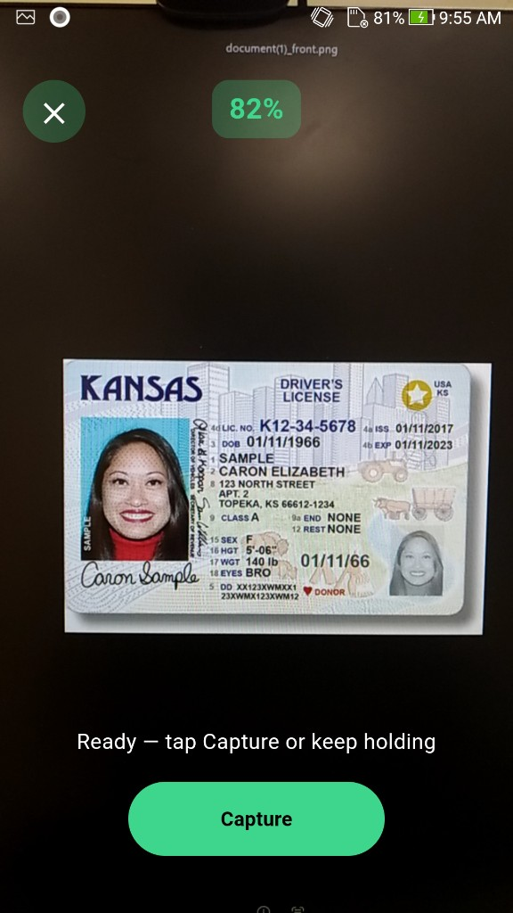
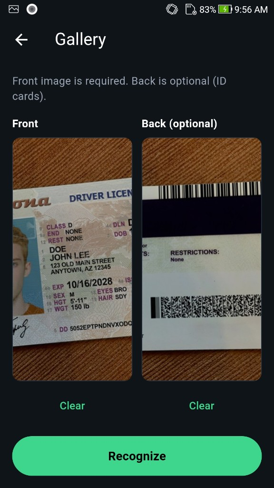
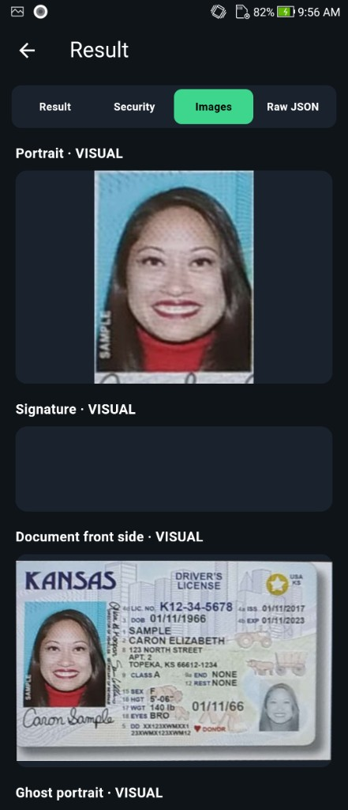

<div align="center">

</div>

#### 🌐 Company Site - [Here](https://faceplugin.com)
#### 🤗 Hugging Face - [Here](https://huggingface.co/FacePlugin-Ltd)
#### 🛟 Help Center - [Here](https://doc.faceplugin.com)
#### 🐳 Docker Hub - [Here](https://hub.docker.com/u/faceplugin)

# FacePlugin ID Document Recognition SDK — React Native (Fully On-Premise)

> Drop Android AAR + iOS framework → run on a **physical** phone (~15 min after Yarn / JDK / NDK are ready).
> Jump: [Quick start](#quick-start) · [Get the runtimes](#get-the-runtimes) · [Run the demo](#run-the-demo) · [Setup](#setup-on-your-own-app) · [JS API](#about-sdk)

Customer repo: [ID-Document-Recognition-React-Native](https://github.com/Faceplugin-ltd/ID-Document-Recognition-React-Native)

## Quick start

Use this for the **example app** (check each box in order). This is the realistic customer path.

**Prerequisites:** Node **18+**, **Yarn 3** (not npm), **JDK 17**, Android NDK `26.1.10909125`. iOS needs **macOS + Xcode 15+**. Use a physical **arm64** phone. **Expo Go is not supported.**

- [ ] Clone `ID-Document-Recognition-React-Native` and run `yarn` at the **repo root** (workspaces; `npm install` is unsupported)
- [ ] Download runtimes from [Get the runtimes](#get-the-runtimes)
- [ ] Android: copy `documentreadersdk.aar` → `example/android/libdocsdk/`
- [ ] iOS: copy `docsdk.framework` → `ios/Frameworks/docsdk.framework`
- [ ] iOS: `cd example && bundle install && cd ios && pod install` → set **your** Xcode Signing Team
- [ ] Run the example on a physical arm64 phone:
  - **Android:** `cd example && yarn android`
  - **iOS (macOS):** `cd example && yarn ios --device`
- [ ] Home status bar shows **Ready** → Camera / Gallery

> Own app? → [Setup on your own app](#setup-on-your-own-app). Docs: [https://doc.faceplugin.com](https://doc.faceplugin.com)

## Introduction

FacePlugin **ID Document Recognition SDK for React Native** is a fully on-device identity verification library for Android and iOS. Scan ID cards, passports, and driver licenses with OCR, MRZ, barcode and QR extraction, live camera overlay, gallery front/back, authenticity / document liveness, and Result / Security / Images / Raw JSON. Package: `document-reader-sdk`. No biometric data leaves the device — built for KYC and cross-platform mobile onboarding.

| Folder          | Purpose                                                     |
| --------------- | ----------------------------------------------------------- |
| Repository root | `document-reader-sdk` — the library you install in your app |
| `example/`      | Demo (Home, Camera, Gallery, Result, About)                 |

Native binaries are **not** on GitHub. Download them from Google Drive (links below).

> **Expo Go is not supported.** You need a development build (bare React Native or Expo prebuild) because this package includes native Android / iOS code.

### Main Functionalities

| Feature                             | Supported |
| ----------------------------------- | --------- |
| ID Card, Passport, and Driver License recognition | ✓         |
| MRZ, Barcode, QR, and OCR data extraction            | ✓         |
| Document detection and type classification | ✓         |
| Auto-capture and image quality        | ✓         |
| Live camera locate overlay          | ✓         |
| Gallery front / optional back       | ✓         |
| Authenticity / Security (document liveness)  | ✓         |
| Result (fields, Security, images, JSON) | ✓     |

### Product List

| Platform | Repository |
|----------|------------|
| Android | [ID-Document-Recognition-Android](https://github.com/Faceplugin-ltd/ID-Document-Recognition-Android) |
| iOS | [ID-Document-Recognition-iOS](https://github.com/Faceplugin-ltd/ID-Document-Recognition-iOS) |
| Windows | [ID-Document-Recognition-Windows](https://github.com/Faceplugin-ltd/ID-Document-Recognition-Windows) |
| Linux / Docker | [ID-Document-Recognition-Docker](https://github.com/Faceplugin-ltd/ID-Document-Recognition-Docker) |
| **React Native** | **[ID-Document-Recognition-React-Native](https://github.com/Faceplugin-ltd/ID-Document-Recognition-React-Native)** (**this repo**) |
| Flutter | [ID-Document-Recognition-Flutter](https://github.com/Faceplugin-ltd/ID-Document-Recognition-Flutter) |
| Ionic Capacitor | [ID-Document-Recognition-Ionic-Capacitor](https://github.com/Faceplugin-ltd/ID-Document-Recognition-Ionic-Capacitor) |
| Ionic Cordova | [ID-Document-Recognition-Ionic-Cordova](https://github.com/Faceplugin-ltd/ID-Document-Recognition-Ionic-Cordova) |
| Linux / Docker (Liveness) | [ID-Document-Liveness-Detection-Docker](https://github.com/Faceplugin-ltd/ID-Document-Liveness-Detection-Docker) |


---

## Before you start

| Step | What you need                                                                                                                                                                                                                                                                              |
| ---- | ------------------------------------------------------------------------------------------------------------------------------------------------------------------------------------------------------------------------------------------------------------------------------------------ |
| 1    | **Node.js 18+**, **Yarn 3** (not npm), React Native environment ([setup guide](https://reactnative.dev/docs/environment-setup)), **JDK 17**                                                                                                                                                |
| 2    | **Physical arm64 device** (x86 emulators do not match `arm64-v8a`)                                                                                                                                                                                                                         |
| 3    | Android: SDK + NDK `26.1.10909125`. iOS: macOS + Xcode 15+ + CocoaPods                                                                                                                                                                                                                     |
| 4    | Android `documentreadersdk.aar` and iOS `docsdk.framework` — [Get the runtimes](#get-the-runtimes)                                                                                                                                                                                         |
| 5    | Demo licenses are in `[example/src/license.ts](example/src/license.ts)` (Android `com.faceplugin.documentreader`, iOS `com.faceplugin.documentreader.app`, valid until **12 August 2027**). Request a new key only if you change `applicationId` / bundle id — [SDK License](#sdk-license) |

Home tiles unlock when the status bar shows **Ready**.

### System requirements

| Item            | Android                                   | iOS                       |
| --------------- | ----------------------------------------- | ------------------------- |
| OS              | API 24 min; **API 29 (10)+ recommended**  | 13.0 min; 16+ recommended |
| Device          | Physical **arm64** phone with rear camera | iPhone with A12 or newer  |
| Host            | Windows / macOS / Linux                   | **macOS only**            |
| RN              | 0.74.x tested (`example/`)                | Same                      |
| Build           | JDK 17 / NDK `26.1.10909125`              | Xcode 15+, CocoaPods      |
| Package manager | **Yarn 3** (workspaces)                   | Same                      |

> Some API-26 devices fail `init()`. Use **Android 10+** when possible.

---

## Get the runtimes

Binaries are gitignored. Copy them **before** your first build.

### Android — `documentreadersdk.aar`

**Download:** [DocumentReader Android runtime (Google Drive)](https://drive.google.com/drive/folders/1nDSfvj0WtC1lZgzwFd7471ECVtk-nuYH)

**Example app:** `example/android/libdocsdk/documentreadersdk.aar`

**Your own app:** `node_modules/document-reader-sdk/android/libs/documentreadersdk.aar`

Gradle fails fast if the AAR is missing.

### iOS — `docsdk.framework`

**Download:** [DocumentReader iOS runtime (Google Drive)](https://drive.google.com/drive/folders/1do6Ws_BlXGkR_K9jI_ULd1zHjqLGSP4q) — unzip if needed.

The engine ships **inside** `docsdk.framework/Frameworks/`. You don't have to copy a separate top-level xcframework.

**Example / library:** `ios/Frameworks/docsdk.framework`

CocoaPods picks it up via `document-reader-sdk.podspec`. Without the framework, iOS fails with `docsdk.framework not linked`.

---

## Run the demo

### 1. Clone and install

```bash
git clone https://github.com/Faceplugin-ltd/ID-Document-Recognition-React-Native.git
cd ID-Document-Recognition-React-Native
yarn          # Yarn 3 workspaces — do not use npm install
```

### 2. Place native runtimes

- Android: `example/android/libdocsdk/documentreadersdk.aar`
- iOS: `ios/Frameworks/docsdk.framework`

### 3. iOS — CocoaPods

```bash
cd example
bundle install          # installs CocoaPods gem (required for yarn ios)
cd ios
pod install
cd ..
```

### 4. Run on device

From `example/` on a physical arm64 phone:

**Android:**

```bash
cd example
yarn android
```

**iOS (macOS):**

```bash
cd example
yarn ios --device "Your iPhone Name"
```

On iOS you can also open `example/ios/DocumentReaderSdkExample.xcworkspace`, pick **your** Signing Team, and Run.

### 5. Use the demo

1. Wait for the home **status bar** → **Ready**.
2. **Camera** — live document overlay; tap **Capture** when score ≥ 50% to run on-device OCR, MRZ, barcode, and authenticity checks.
3. **From Gallery** — pick Front (required) and Back (optional), then Recognize for two-sided ID processing.
4. **Result** — tabs **Result** / **Security** / **Images** / **Raw JSON** for fields, liveness, crops, and the full JSON response.

| Platform                | Identifier                          |
| ----------------------- | ----------------------------------- |
| Android `applicationId` | `com.faceplugin.documentreader`     |
| iOS bundle id           | `com.faceplugin.documentreader.app` |

### Screenshots

<p align="center">

&nbsp;

&nbsp;

</p>

<p align="center">

&nbsp;

&nbsp;

</p>

<p align="center">

&nbsp;

</p>

---

## SDK License

Licenses are **offline** and bound to your `applicationId` / bundle identifier.

The sample app already includes a valid key for `com.faceplugin.documentreader` (Android) / `com.faceplugin.documentreader.app` (iOS) (until **12 August 2027**). You only need a new key if you use a different id.

### How to get a license

The code below shows how to use the license:

[https://github.com/Faceplugin-ltd/ID-Document-Recognition-React-Native/blob/65da1e92337250e8db55272cabc233459f38b764/example/src/license.ts#L13-L21](https://github.com/Faceplugin-ltd/ID-Document-Recognition-React-Native/blob/65da1e92337250e8db55272cabc233459f38b764/example/src/license.ts#L13-L21)

[https://github.com/Faceplugin-ltd/ID-Document-Recognition-React-Native/blob/65da1e92337250e8db55272cabc233459f38b764/example/src/SdkContext.tsx#L61-L75](https://github.com/Faceplugin-ltd/ID-Document-Recognition-React-Native/blob/65da1e92337250e8db55272cabc233459f38b764/example/src/SdkContext.tsx#L61-L75)

Please [contact us](#contact) to get a license for **your own app**.

### License capabilities (Recognition + Liveness)

After activation, `getLicenseStatus` reports what the key unlocks. Home shows the same summary on the status bar (for example **Ready · Recognition + Liveness**). About shows **License: …**.

| Capability | Meaning |
| ---------- | ------- |
| **Recognition** | OCR, MRZ, barcode/QR, and document type classification |
| **Liveness** (authenticity) | Document authenticity: physical document, security patterns, photo origin, barcode format |

Typical labels:

- **Recognition + Liveness** — full identity verification (Result + Security tabs)
- **Recognition** — OCR, MRZ, and barcode only; Security stays empty / not checked
- **Liveness** — authenticity / document liveness only; OCR/MRZ/barcode stays empty / not checked
- **Not licensed** — until you activate

---

## Setup on your own app

You need the `document-reader-sdk` package, the native runtimes, and a few lines of JS. You do **not** need the example screens.

### 1. Install

`document-reader-sdk` is not on npm yet. Install from GitHub:

```bash
yarn add document-reader-sdk@git+https://github.com/Faceplugin-ltd/ID-Document-Recognition-React-Native.git
```

Then `yarn install` and `cd ios && pod install`. Rebuild the **native** app after install — a JS reload is not enough.

### 2. Copy runtimes

| Platform      | Copy to                                                               |
| ------------- | --------------------------------------------------------------------- |
| Android AAR   | `node_modules/document-reader-sdk/android/libs/documentreadersdk.aar` |
| iOS framework | `node_modules/document-reader-sdk/ios/Frameworks/docsdk.framework`    |

Android: `minSdkVersion 24` and `abiFilters 'arm64-v8a'`. Set **your** `applicationId` / bundle id and request a license for **that** id.

`AndroidManifest.xml`:

```xml
<uses-permission android:name="android.permission.CAMERA" />
<uses-permission android:name="android.permission.READ_MEDIA_IMAGES" />
<uses-permission android:name="android.permission.READ_EXTERNAL_STORAGE" android:maxSdkVersion="32" />
```

`Info.plist`:

```xml
<key>NSCameraUsageDescription</key>
<string>Camera is used to capture identity documents for OCR.</string>
<key>NSPhotoLibraryUsageDescription</key>
<string>Photo library access is used to select document images.</string>
```

### 3. Activate and recognize

```ts
import {
  getMachineCode,
  setActivation,
  init,
  recognize,
  locateDocument,
  SDK_SUCCESS,
} from 'document-reader-sdk';

async function bootDocReader() {
  const machine = await getMachineCode(); // send when requesting a license
  const act = await setActivation('FP1.…');
  if (act !== SDK_SUCCESS) throw new Error(`Activation failed: ${act}`);
  const code = await init();
  if (code !== SDK_SUCCESS) throw new Error(`Init failed: ${code}`);
}

const json = await recognize('file:///path/to/front.jpg', null, true);
const locateJson = await locateDocument(snapshotUri);
```

---

## About SDK

Fully on-device ID document OCR for React Native. One TypeScript API for Android and iOS; `recognize()` returns the **same canonical result shape**.

| Method                                                 | Role                                                     |
| ------------------------------------------------------ | -------------------------------------------------------- |
| `getMachineCode` / `setActivation` / `init` / `deinit` | License + engine lifecycle                               |
| `getLicenseStatus`                                     | Recognition / Liveness flags + label                     |
| `locateDocument`                                       | Live corners + score (overlay)                           |
| `recognize`                                            | Canonical JSON **string** (OCR / MRZ / barcode / images / security) |
| `recognizeResult`                                      | Same data as a typed `DocResult`                         |
| `normalizeResult`                                      | Android → iOS schema (also used inside `recognize`)      |
| `lastLicenseError`                                     | Human-readable license failure                           |

Status `0` (`SDK_SUCCESS`) means activate / init succeeded. `1` invalid, `2` expired, `3` not activated, `4` init failed.

Call order: `getMachineCode` → `setActivation` → `init` → `getLicenseStatus` → `recognize` / `locateDocument`.

`recognize` / `recognizeResult` return the same keys on Android and iOS: `errorCode`, `documentName`, `countryName`, `score`, `verification`, `imageQuality`, `ocr`, `mrz`, `barcode`, `images`, `security`.

---

## Example app layout

| Path                          | Role                                                |
| ----------------------------- | --------------------------------------------------- |
| `example/src/license.ts`      | Demo `FP1.…` keys only                              |
| `example/src/SdkContext.tsx`  | Activate + init on launch                           |
| `example/src/screens/`        | Home, Camera (live overlay), Gallery, Result, About |
| `example/src/resultParser.ts` | Demo Result-tab labels                              |

---

## Contact

<div align="left">
<a target="_blank" href="mailto:info@faceplugin.com"></a>&emsp;
<a target="_blank" href="https://wa.me/+14692784822"></a>
</div>
